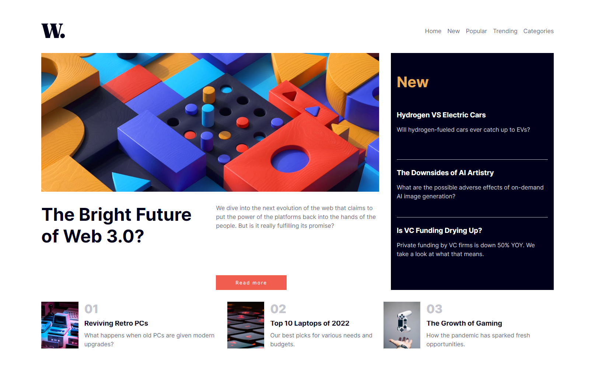

# News Homepage

## Overview

This project showcases a News Homepage, designed to present articles, trending topics, and latest news in a visually appealing and interactive manner. The homepage is built using HTML, CSS, and JavaScript, incorporating a responsive design for accessibility across all devices. The inclusion of a hamburger menu for mobile viewers ensures a user-friendly experience.

## Features

- **Responsive Layout:** The layout adapts seamlessly to various screen sizes, enhancing usability and readability.
- **Interactive Hamburger Menu:** A JavaScript-enabled hamburger menu provides a compact and intuitive navigation solution on smaller screens.
- **Dynamic Content Sections:** Features main articles, new articles, and footer sections to engage users with diverse content.

## Screenshots




## Setup

To use this component in your project, follow these steps:

1. **Clone the Repository:**

```bash
git clone https://github.com/Wilmer856/news-homepage.git
```

2. **Navigate to the Project Directory:**

```bash
cd news-homepage-main
```

3. **Open the `index.html` file in a web browser to view the component.**

## Customization

- **Content and Images:** Replace the images and text in the assets/images directory and HTML file to tailor the content to your specific news topics.
- **Functionality:** Enhance the interactivity or add new features by updating the 'index.js' file. This could include adding animations or integrating with a news API for live article updates.
- **Styling:** Tailor the CSS in 'styles.css' to align with your branding requirements, such as colors and font sizes.
